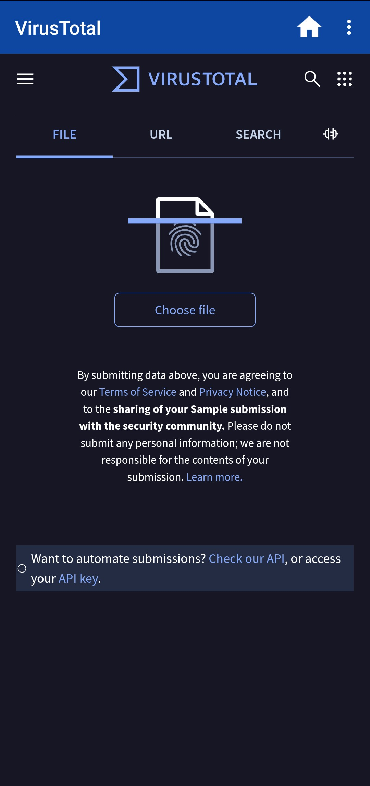
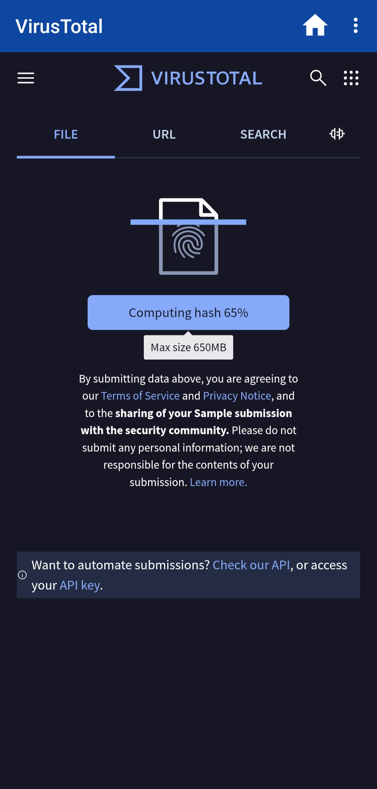
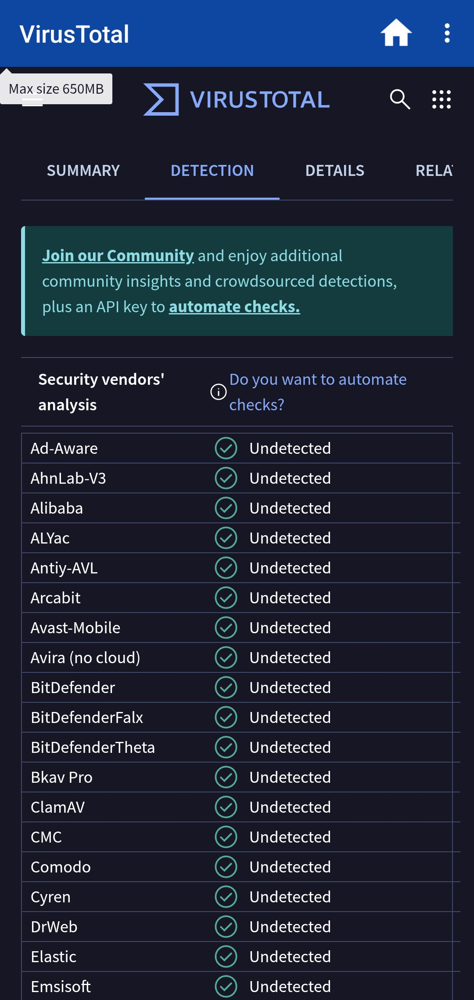
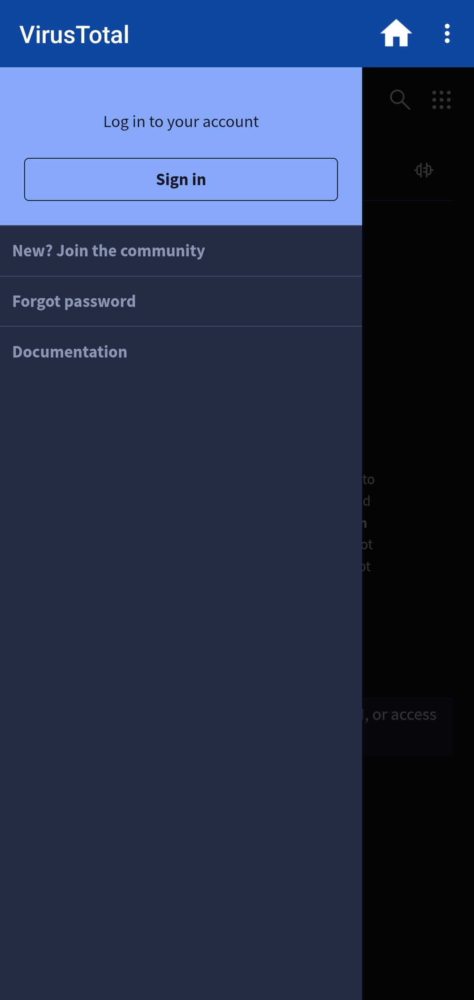
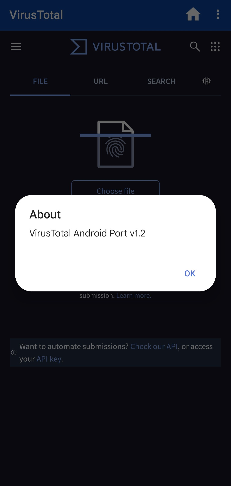

# VirusTotal Android
A [VirusTotal](https://www.virustotal.com) port to Android made with Website2APK

Sometimes, using VirusTotal on Android isnt the best experience, so i decided to help you by making a dedicated app! That way, you dont have to open you browser all the time. 
The app is pretty useful if you dont wanna waste you time. 

And also, if you think this is a virus (which it is not), you can you VirusTotal to scan it! What a coincidence

## Screenshots
 &nbsp;  &nbsp;  &nbsp;  &nbsp; 
